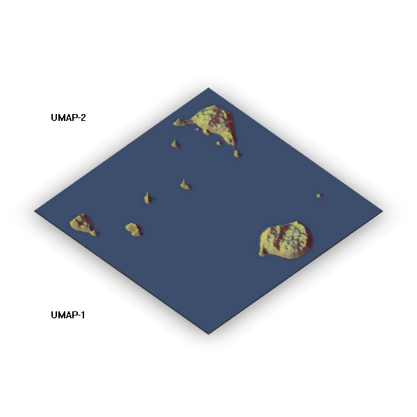

```{r markdown setup, include=FALSE}
knitr::opts_chunk$set(echo = TRUE, dev = "png", cache = TRUE, dpi = 150,
                      fig.path = "map_figures/")
```


## Setup
```{r setup}
library(tidyverse)
library(scico)
library(scales)
library(uwot)
mydata <- read_tsv("AML_normal_viSNEgates_concat.fcs_raw_events.txt", 
                     skip = 1)
set.seed(1)
```

## Transforming the data
For more information about the importance of data transformations see: [UMAP on Cytof](https://github.com/bjreisman/umap_cytof/blob/master/20181005_umap.md)
```{r data cleaning}
mydata.mapping <- 
  mydata %>%
  dplyr::select(contains('(V)')) %>%
  mutate_all(function(x) asinh(x/5))
```


```{r umap and axis scaling}
myumap <- uwot::umap(mydata.mapping, verbose = FALSE, ret_model = TRUE)


#manually expanding the axis, as the usual `expand` function doesn't expand
#the area rendered by `geom= 'raster'.

axis.min <- apply(myumap$embedding, 2, min) - 1
axis.max <- apply(myumap$embedding, 2, max) + 1
```


Here's the normal way to plot the UMAP embeddings, as points in 2D space. Here I set the point's to be partially transparent (`alpha = 0.05`), to give a better sense of the density. 
```{r ggplot points}
umap.point<- as_tibble(myumap$embedding) %>% 
  ggplot(aes(x= V1, y = V2)) + 
  geom_point(shape = ".", alpha = 0.05) + 
  scale_x_continuous(expand = c(0,0), limits = c(axis.min[1], axis.max[1])) + 
  scale_y_continuous(expand = c(0,0), limits = c(axis.min[2], axis.max[2])) + 
  coord_fixed() +
  labs(caption =
"Data from: KE Diggins, PB Ferrell, JM Irish, Methods 2015, 82, 55-63
       Flow Repository: FR-FCM-ZZKZ", 
       x = 'UMAP-1', 
       y = 'UMAP-2', 
       title = 'UMAP as transparent points',
       subtitle = 'Benjamin Reisman, 2018') + 
  theme_minimal()

umap.point

```


We can also plot the UMAP as a density map using built in funciton in ggplot2. 
```{r ggplot map 1}

umapmap <- as_tibble(myumap$embedding) %>% 
  ggplot(aes(x= V1, y = V2)) + 
  stat_density_2d(h = c(0.5, 0.5), #this controls the kernel density smoothing, lower will bring out finer details
                  n = 1024, #this controls the nubmer of points at which the kd is calculated, higher is 'higher res' but slower
                  geom = "raster", 
                  contour = F,
                  aes(fill = stat(density))) + 
  scale_fill_viridis_c(option = "A", name = "density") + 
#  scale_fill_scico(palette = "batlow", name = "density", trans = "sqrt") + 
  scale_x_continuous(expand = c(0,0), limits = c(axis.min[1], axis.max[1])) + 
  scale_y_continuous(expand = c(0,0), limits = c(axis.min[2], axis.max[2])) + 
  coord_fixed() +
  labs(caption =
       "Data from KE Diggins, PB Ferrell, JM Irish, Methods 2015, 82, 55-63.
       Flow Repository: FR-FCM-ZZKZ", 
       x = 'UMAP-1', 
       y = 'UMAP-2', 
       title = 'Putting the \'map\' in UMAP', 
       subtitle = 'Benjamin Reisman, 2018')

umapmap
```

They kind of look like islands in a sea. Using Thomas Lin Pedersen's [scico](https://github.com/thomasp85/scico) package and the `oleron` palette, we can make just such a map!
```{r ggplot map 2}

umap.map.lin <- as_tibble(myumap$embedding) %>% 
  ggplot(aes(x= V1, y = V2)) + 
  stat_density_2d(h = c(0.5, 0.5), n = 1024, geom = "raster", 
                  contour = F, aes(fill = stat(density))) + 
  scale_fill_scico(palette = "oleron", name = "density") + 
  scale_x_continuous(expand = c(0,0), limits = c(axis.min[1], axis.max[1])) + 
  scale_y_continuous(expand = c(0,0), limits = c(axis.min[2], axis.max[2])) + 
  coord_fixed() +
  labs(caption =
"Data From KE Diggins, PB Ferrell, JM Irish, Methods 2015, 82, 55-63.
       Flow Repository: FR-FCM-ZZKZ", 
       x = 'UMAP-1', 
       y = 'UMAP-2', 
       title = 'Putting the \'map\' in UMAP', 
       subtitle = 'Benjamin Reisman, 2018')
umap.map.lin
```


Looks nice! However, most of hte points are below 'sea level'. Applying an 'sqrt' transformation to the fill scale helps bring more of the 'land' above the 'sea.'
```{r ggplot map 3}

umap.map.sqrt <- as_tibble(myumap$embedding) %>% 
  ggplot(aes(x= V1, y = V2)) + 
  stat_density_2d(h = c(0.5, 0.5),
                  n = 1024, 
                  geom = "raster", 
                  contour = F,
                  aes(fill = stat(density))) + 
  scale_fill_scico(palette = "oleron", name = "density", trans = "sqrt") + 
  scale_x_continuous(expand = c(0,0), limits = c(axis.min[1], axis.max[1])) + 
  scale_y_continuous(expand = c(0,0), limits = c(axis.min[2], axis.max[2])) + 
  coord_fixed() +
  labs(caption =
       "Data from KE Diggins, PB Ferrell, JM Irish, Methods 2015, 82, 55-63.
       Flow Repository: FR-FCM-ZZKZ", 
       x = 'UMAP-1', 
       y = 'UMAP-2', 
       title = 'Putting the \'map\' in UMAP', 
       subtitle = 'Benjamin Reisman, 2018')

umap.map.sqrt
```


A similar effect can be achieve using the `rayshader` pacakge but it takes a bit more work. 
```{r rayshader map}
library(rayshader)
library(raster)
library(KernSmooth) #faster KD estimation than MASS
library(rgl)


umap.bkde2D <- bkde2D(x = myumap$embedding, 
       bandwidth = c(0.1, 0.1), 
       gridsize = c(1024, 1024), 
       range.x = list(c(axis.min[1], axis.max[1]),
                      c(axis.min[2], axis.max[2])))

umap.kd.mat <- matrix(umap.bkde2D$fhat, nrow = 1024, byrow = TRUE)
umap.kd.mat.scaled <- umap.kd.mat*10000 #brings everthing into scale

#fancy shadows
shadow1 <- ray_shade(umap.kd.mat.scaled, zscale = 25, progbar = FALSE)
shadow2 <- ambient_shade(umap.kd.mat.scaled, zscale = 25, progbar = FALSE)

umap.kd.mat.scaled %>%
  sphere_shade(texture ="imhof3", progbar = FALSE) %>%
  add_shadow(shadow1) %>%
  add_shadow(shadow2) %>%
  plot_3d(umap.kd.mat.scaled, water=TRUE, zscale=25, theta=-45, phi = 45,
        waterdepth = 1, wateralpha = 0.6, watercolor = "#1a265a")
  title3d(xlab = 'UMAP-2',
          zlab = 'UMAP-1',
          color = "black")
  #rgl.bringtotop()
  rgl::snapshot3d('map_figures/3d_plot.png')

```

